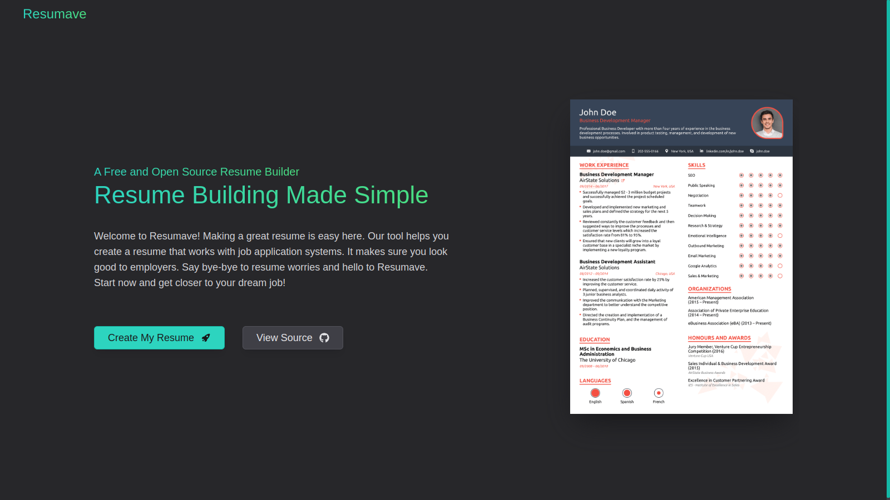
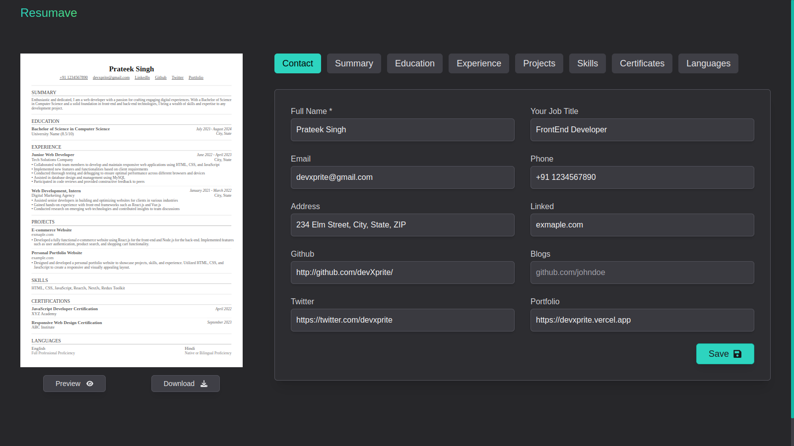

<!-- ## Resumave -->

<!-- Resumave is an ATS-friendly resume maker designed to simplify the process of creating professional resumes without the hassle of login or sign-up. With Resumave, users can easily input their details, generate a well-formatted resume, and export it in A4 PDF format. -->

<h1 align="center">Resumave</h1>
<h3 align="center">An ATS-friendly resume maker</h3>

<p align="center">
 <a href="https://resumave.vercel.app/">View Demo</a>
    ·
    <a href="https://github.com/devXprite/resumave/issues/new?assignees=&labels=bug&template=bug_report.md&title=">Report Bug</a>
</p>
<br/>


<p>Resumave is an ATS-friendly resume maker designed to simplify the process of creating professional resumes without the hassle of login or sign-up. With Resumave, users can easily input their details, generate a well-formatted resume, and export it in A4 PDF format. </p>


## Features

- **ATS-Friendly:** Ensures compatibility with Applicant Tracking Systems (ATS) commonly used by recruiters.
- **User-Friendly Interface:** simple and intuitive interface for easy navigation and data input.
- **No Login Required:** Users can access all features without the need for registration or authentication.
- **PDF Export:** Generate resumes in A4 PDF format for easy printing and sharing.
- **Persistent Data:** Utilizes local storage to save user data, preventing loss when the browser is closed.
- **Responsive Design:** It's designed to be responsive, ensuring a seamless experience across various devices and screen sizes.


## Technologies Used
- **Next.js:** A React framework for building server-side rendered and static web applications.
- **Tailwind CSS:** A utility-first CSS framework for creating custom designs with ease.
- **Redux:** A predictable state container for managing application state.
- **React PDF:** A library for creating PDFs using React components.

## Screenshots




## Installation
If you want to run Resumave locally, follow these steps:

1. Clone the repository:
   ```bash
    git clone https://github.com/devxprite/resumave.git
   ```

2. Navigate to the project directory:
    ```bash
    cd resumave
    ```
3. Install dependencies:
    ```bash
    npm install
    ```
4. Start the development server:
    ```bash
    npm run dev
    ```
5. Open your browser and visit `http://localhost:3000`
   


## Contributing
Contributions are welcome! If you encounter any issues or have suggestions for improvements, please feel free to open an issue or submit a pull request.


## Usage
To use Resumave, simply visit [resumave.vercel.app](https://resumave.vercel.app) and start filling out your details. Once complete, you can export your resume in PDF format.

## License
This project is licensed under the MIT License. see the LICENSE file for details.
